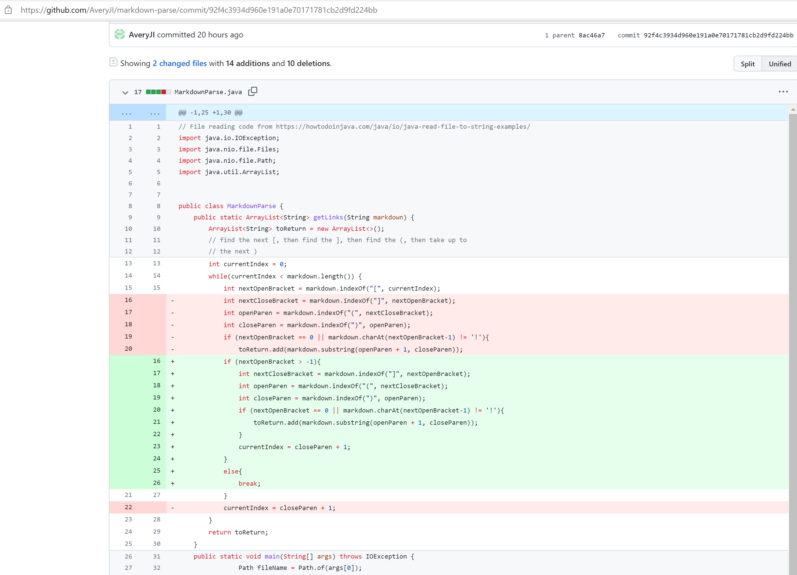

# Lab Report for [Week 4](https://ucsd-cse15l-w22.github.io/week/week4/#week-4-lab-report)
### The stuff displayed below is practice from [Week 3](https://ucsd-cse15l-w22.github.io/week/week3/).
### Here is the [course site](https://ucsd-cse15l-w22.github.io/).
` `  
1. ### The failling output induced by [test-file.md](https://github.com/AveryJI/markdown-parse/blob/main/test-file.md) :  
   
` `  

### The first edit of the code :

` `  

The test file stores a link to a webpage and a link to an image. The code should only output the link of the webpage, but it ouputs both the linke of the webpage and the image. This is because there is no checking of the "!" before the link of the image in the code.
` `  
` `  
` `  

2. ### The failing output induced by [test-file3.md](https://github.com/AveryJI/markdown-parse/blob/main/test-file3.md) : 

` `   

### The second edit of the code :

` `  

When the first open bracket is at location 0, the "openBracket-1" in the if statement of the code will cause the index-out-of-bound error. Hence, the code will first check if the open bracket is at location 0.
` `  
` `  
` `  

3. ### The failing output induced by [test-file2.md](https://github.com/AveryJI/markdown-parse/blob/main/test-file2.md) :

` `  

### The third edit of the code :

` `  

After finding all the links in the test file, the loop continues to search for the next open bracket. Since there is no more link in the file, the value stored in next openBracket is -1. This will cause the original if statement to give an index-out-of-bound error. So, the code will first check if there is any open bracket left in the file.

