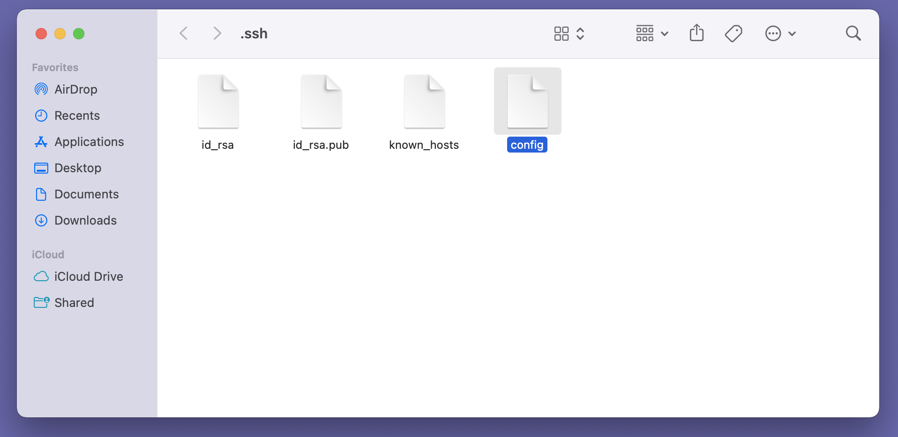
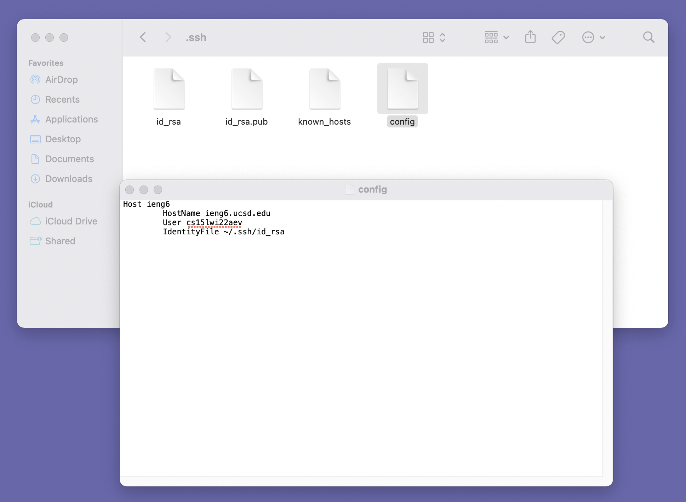
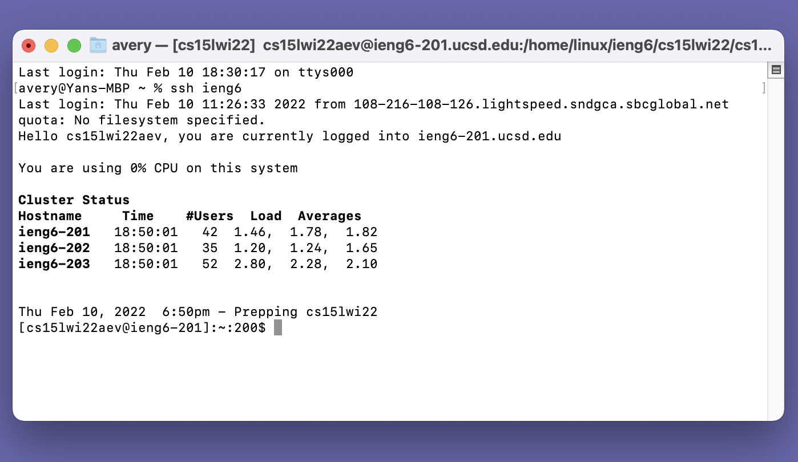
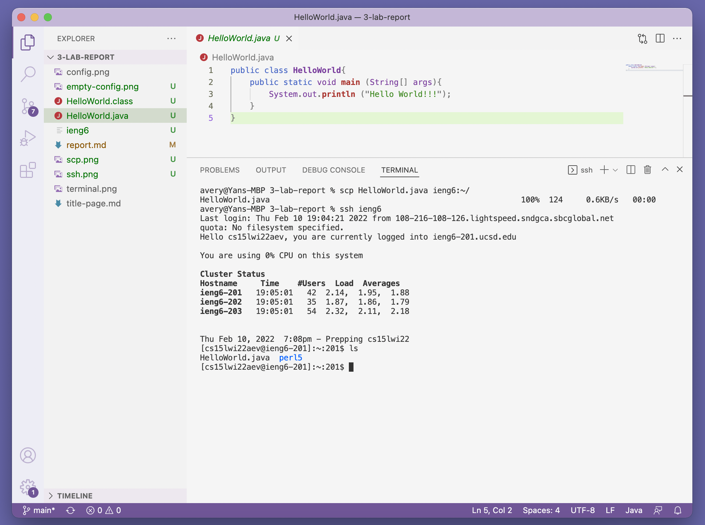

# Streamlining ssh Configuration

* First, use terminal to create the config file in the ~/.ssh directory.

* Go to the ~/.ssh directory and open the config file by TextEdit.

* Add lines showed in the screenshot below to the config file that was just being created.

* Try log in to the ieng6 account using the alias just invented.

* Try copy a file from the local computer to ieng6 using the alias just invented.

* Log into the ieng6 account and check if the file has been copied successfully.

