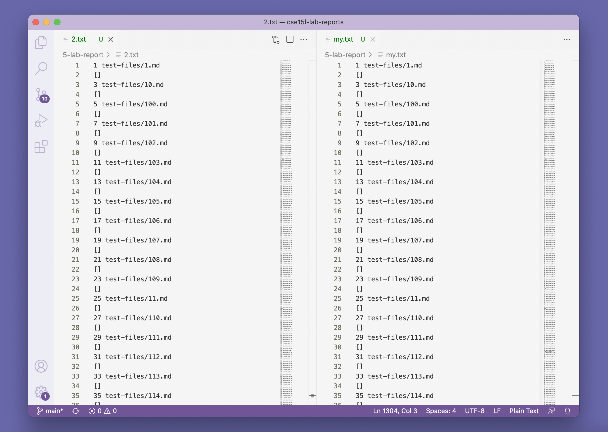

# Lab Report 5

* 
    - First I stored the results of tests in results.txt file for each implementation. 

        
        

    - Then I compared the difference between those two results.txt files by using "diff" command.

        

    - In order to identify the test files that indued those different outputs, the names of all test files will be printed out every time the script.sh file is excuted.

        

    - To make finding the lines in the result.txt files more easily, I copied and pasted the content in each result.txt file into a new local text file opened in Visual Studio Code.

        

*
    1. 
        - One of the different outputs is in line 866. This test is stored in 489.md file. The correct output is "[]" which is given by the provided implementation.

            

        - My own code gave the incorrect output. The bug is that it doesn't check if there is any "/n" in the content of the url. Any url containing "/n" should be considered invalid. The code should be fixed is circled in red.

            

      

    2. 
        - Another one of the different outputs is in line 880 vs. 882. This test is stored in 495.md file. The different line number here is the result of the different output in line 866 as showed in the previous example. The correct output is "foo(and(bar))" which is given by the provided implementation.

            

        - My own code gave the incorrect output. The bug is that it doesn't check if the url contains any ")". It seekes the first ")" and treat it as the mark of the end of the url. The code should be fixed is circled in red .

            

        
