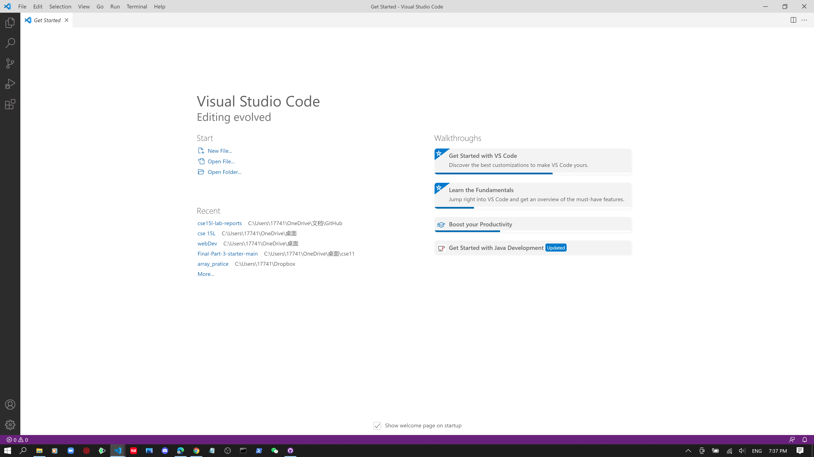
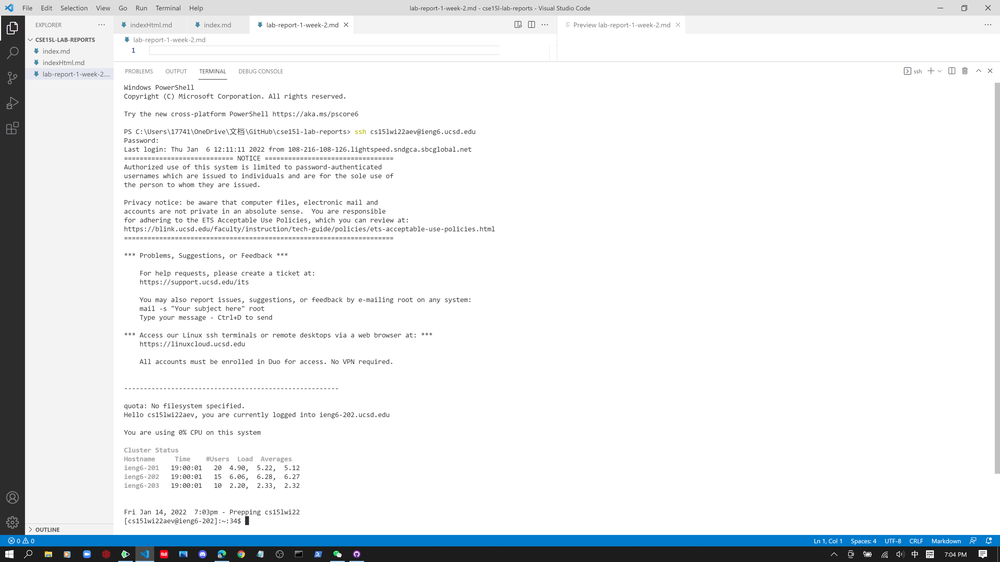
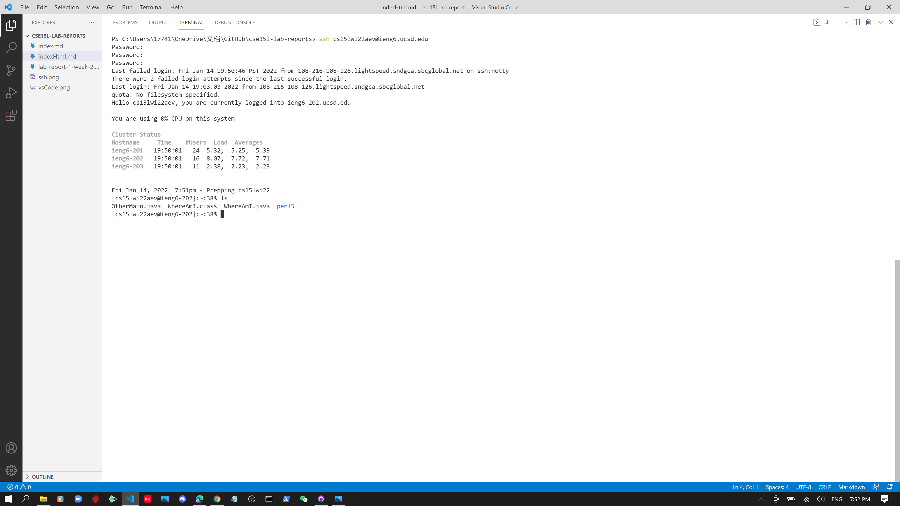
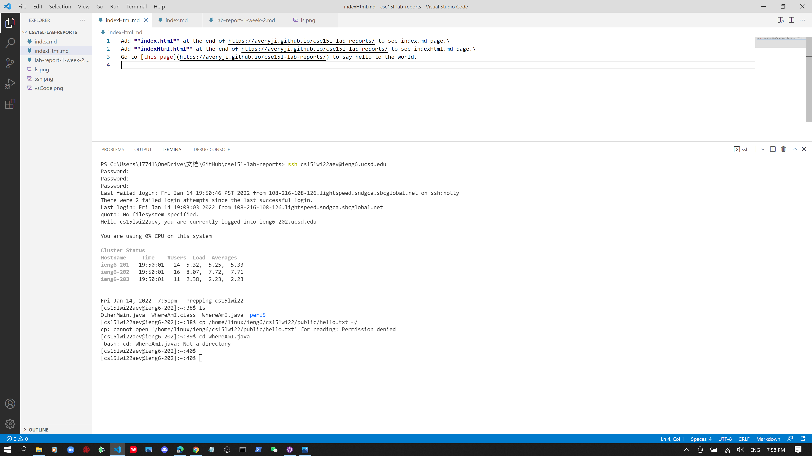
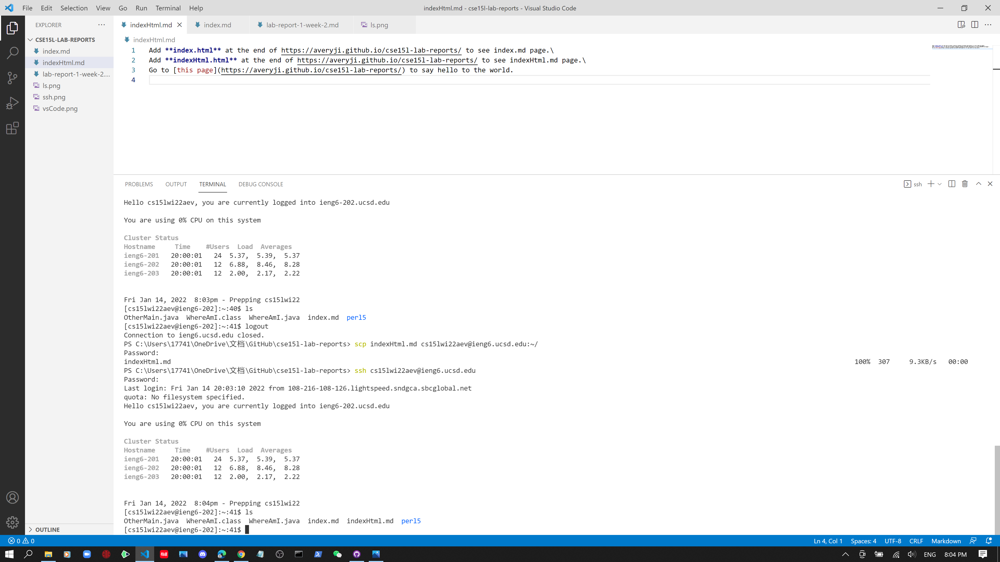
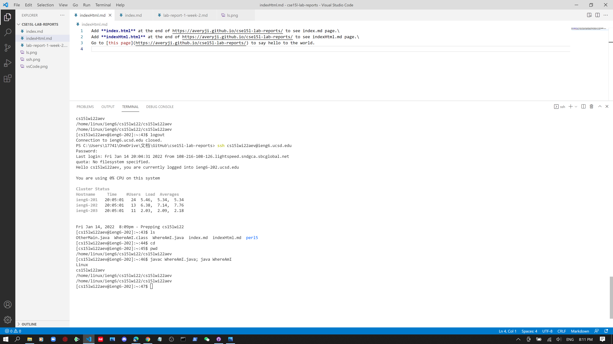

# Lab Report for [Week 2](https://ucsd-cse15l-w22.github.io/week/week2/#setting-up-a-web-page)
### The stuff displayed below is practice from [Week 1 ](https://ucsd-cse15l-w22.github.io/week/week1/).
### Here is the [course site](https://ucsd-cse15l-w22.github.io/).
1. Install Visual Studio Code.\

2. Remotely connect to ieng\

3. Try out "ls" command.\

4. Try out "cd" command.\

5. Try copy a local file and paste it to ieng.\

6. Run multiple commend in one line.
